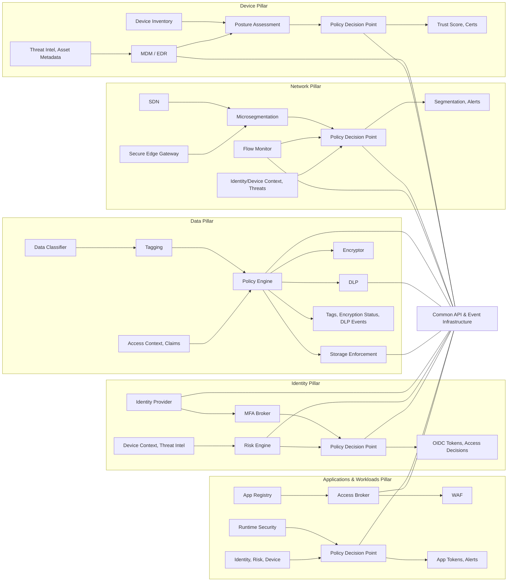

# zt-info-model
Basic information model to support a cross-vendor Zero Trust deployment.

## Intent

This project describes a vendor agnostic information model for a Zero Trust installation, with a focus on the underlying information model and the data relationships between conponents. This provides context for individual component owners / developers so that they can better understand how their services interact with others.

## Cross-Pillar Information Model

