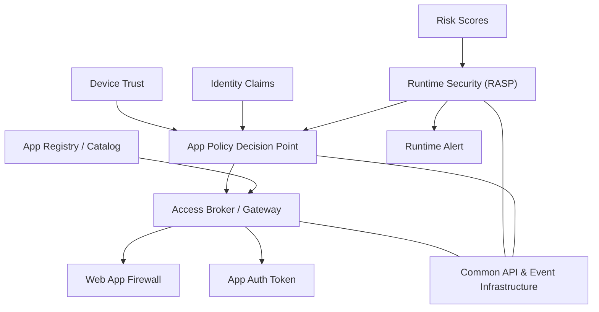

# Applications & Workloads Pillar

This pillar ensures secure access to applications and workloads through strong access control, real-time policy evaluation, and runtime protection.

Key Components:
- App Registry: Catalogs registered services and APIs. [NIST SP 800-218](https://csrc.nist.gov/publications/detail/sp/800-218/final)
- Access Broker: Mediates requests between users/devices and workloads. [NIST SP 800-207](https://csrc.nist.gov/publications/detail/sp/800-207/final)
- Web App Firewall (WAF): Protects HTTP applications from attacks. [CISA Application Security](https://www.cisa.gov/news-events/news/protecting-web-applications-and-apis-against-threats)
- Runtime Security (RASP): Monitors application behavior. [NIST SP 800-160 Vol 1](https://csrc.nist.gov/publications/detail/sp/800-160/vol-1/final)
- Policy Decision Point: Authorizes access based on risk and identity context.

Inputs:
- Identity tokens
- Risk scores and device trust levels

Outputs:
- App session tokens
- Runtime alerts

## Application Pillar - Information Model

  
## References

- [CISA Zero Trust Maturity Model v2.0 – Applications & Workloads Pillar](https://www.cisa.gov/resources-tools/resources/zero-trust-maturity-model)
- [NIST SP 800-207 – Zero Trust Architecture](https://csrc.nist.gov/publications/detail/sp/800-207/final)
- [NIST SP 800-218 – Secure Software Development Framework](https://csrc.nist.gov/publications/detail/sp/800-218/final)
- [NIST SP 800-160 Vol 1 – System Security Engineering](https://csrc.nist.gov/publications/detail/sp/800-160/vol-1/final)
- [CISA – Web Application and API Protection](https://www.cisa.gov/news-events/news/protecting-web-applications-and-apis-against-threats)
