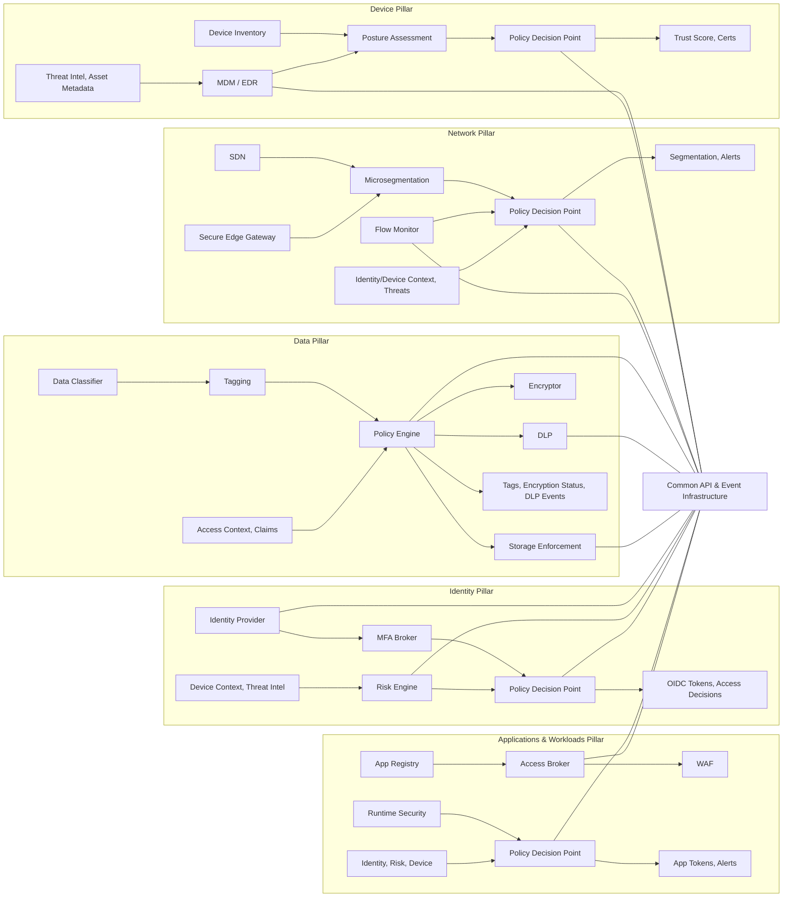

# Cross-Pillar Overview

### Cross-Pillar Integration Diagram

This diagram illustrates how each CISA Zero Trust Pillar integrates with others through a shared integration infrastructure layer. It emphasizes information flow and decision-making across the architecture.

Each pillar is enclosed in a subgraph and highlights:

- Major internal components
- Inputs and outputs
- Connection to shared APIs and event brokers

The Shared Integration Infrastructure enables:
- Real-time identity and posture evaluation
- Attribute- and risk-based access decisions
- Coordinated alerting and response
- Vendor-neutral event-driven orchestration

## Cross-Pillar Information Model

  
## References

- [CISA Zero Trust Maturity Model v2.0 – All Pillars](https://www.cisa.gov/resources-tools/resources/zero-trust-maturity-model)
- [NIST SP 800-207 – Zero Trust Architecture](https://csrc.nist.gov/publications/detail/sp/800-207/final)

