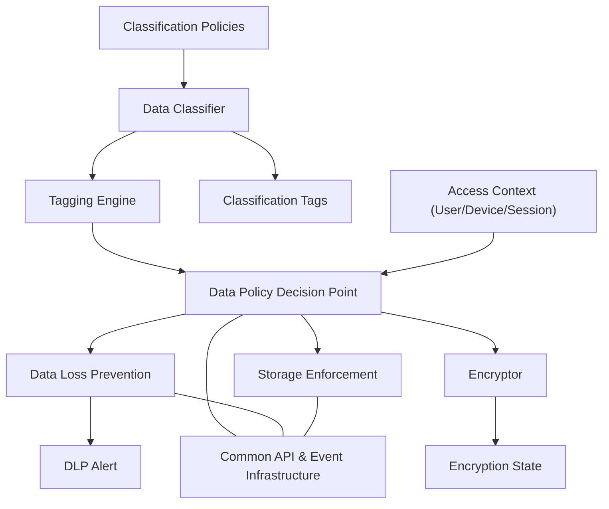

# Data Pillar

The Data Pillar governs the classification, protection, and secure handling of all data, regardless of location. It ensures that access to data is tightly controlled, monitored, and based on policy-driven context.

Key Components:
- Data Classifier: Tags data based on sensitivity. [NIST SP 800-60 Vol 2](https://csrc.nist.gov/publications/detail/sp/800-60/vol-2-rev-1/final)
- Tagging Engine: Embeds classification metadata. [CISA ZTMM Data Pillar](https://www.cisa.gov/resources-tools/resources/zero-trust-maturity-model)
- DLP (Data Loss Prevention): Prevents unauthorized exfiltration. [NIST SP 800-171](https://csrc.nist.gov/publications/detail/sp/800-171/rev-2/final)
- Encryptor: Applies file- or volume-level encryption. [NIST SP 800-111](https://csrc.nist.gov/publications/detail/sp/800-111/final)
- Storage Enforcement: Enforces location-based access controls. [NIST SP 800-53 - SC-28, SC-12](https://csrc.nist.gov/publications/detail/sp/800-53/rev-5/final)
- PDP: Evaluates policies related to classification and encryption.

Inputs:
- Access context (user/device/session)
- Classification policies

Outputs:
- Tags
- Encryption state
- DLP alerts

## Data Pillar - Information Model

  
## References

- [CISA Zero Trust Maturity Model v2.0 – Data Pillar](https://www.cisa.gov/resources-tools/resources/zero-trust-maturity-model)
- [NIST SP 800-60 Vol 2 – Information and System Categorization](https://csrc.nist.gov/publications/detail/sp/800-60/vol-2-rev-1/final)
- [NIST SP 800-111 – Guide to Storage Encryption](https://csrc.nist.gov/publications/detail/sp/800-111/final)
- [NIST SP 800-171 – Protecting Controlled Unclassified Information](https://csrc.nist.gov/publications/detail/sp/800-171/rev-2/final)
- [NIST SP 800-53 – Security and Privacy Controls (SC-12, SC-28)](https://csrc.nist.gov/publications/detail/sp/800-53/rev-5/final)
