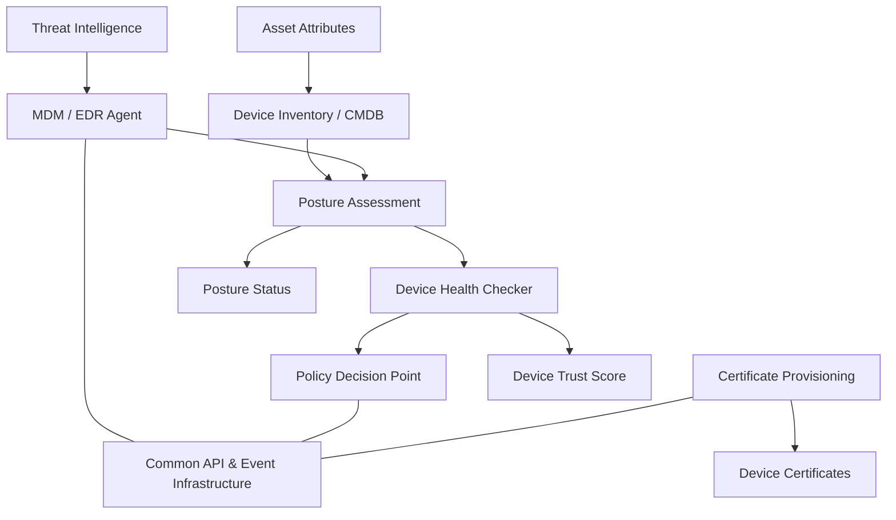

# Device Pillar

The Device pillar provides visibility and policy enforcement around the health, posture, and trustworthiness of all endpoints attempting to connect.

Key Components:
- MDM/EDR Agent: Gathers telemetry, enforces security posture. [NIST SP 800-124 Rev. 2](https://csrc.nist.gov/publications/detail/sp/800-124/rev-2/final)
- Device Inventory (CMDB): Tracks known and managed devices. [NIST SP 800-53 - CM-8](https://csrc.nist.gov/publications/detail/sp/800-53/rev-5/final)
- Posture Assessment: Evaluates compliance against baseline. [CISA ZTMM Device Pillar](https://www.cisa.gov/resources-tools/resources/zero-trust-maturity-model)
- Health Checker: Verifies real-time trustworthiness. [NIST SP 800-207 - ZTA](https://csrc.nist.gov/publications/detail/sp/800-207/final)
- Certificate Provisioner: Issues and rotates device credentials. [NIST SP 800-57](https://csrc.nist.gov/publications/detail/sp/800-57-part-1/rev-5/final)
- PDP: Makes device-based policy decisions.

Inputs:
- Asset registry metadata
- Threat intelligence

Outputs:
- Trust scores
- Certificates
- Posture reports

  

## References

- [CISA Zero Trust Maturity Model v2.0 – Device Pillar](https://www.cisa.gov/resources-tools/resources/zero-trust-maturity-model)
- [NIST SP 800-124 Rev. 2 – Mobile Device Security](https://csrc.nist.gov/publications/detail/sp/800-124/rev-2/final)
- [NIST SP 800-53 – Security and Privacy Controls (CM-8)](https://csrc.nist.gov/publications/detail/sp/800-53/rev-5/final)
- [NIST SP 800-57 – Key Management Guidelines](https://csrc.nist.gov/publications/detail/sp/800-57-part-1/rev-5/final)
- [NIST SP 800-207 – Zero Trust Architecture](https://csrc.nist.gov/publications/detail/sp/800-207/final)
