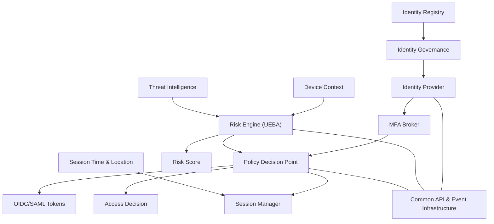

# Identity Pillar

The Identity pillar ensures that users and services are strongly authenticated, authorized, and continuously evaluated. It integrates multiple sources of identity context, evaluates risk in real time, and issues verifiable claims to other Zero Trust components.

**Key Components**:
- **Identity Sources**: Source of truth for identity metadata.
- **IGA (Identity Governance)**: Manages identity lifecycle and policy.
- **IdP (Identity Provider)**: Issues identity tokens and handles authentication.
- **MFA Broker**: Provides step-up and contextual authentication.
- **Risk Engine**: Assesses identity risk based on behavior, device, and context.
- **PDP (Policy Decision Point)**: Evaluates access policies.
- **Session Manager**: Binds session context and monitors active logins.

**Inputs**:
- Device posture and session context
- Threat intelligence feeds

**Outputs**:
- Auth tokens (OIDC/SAML)
- Access decisions and identity claims
- Risk scores

## Identity Pillar - Information Model

  
# References
[CISA Zero Trust Maturity Model v2.0 – Identity Pillar](https://www.cisa.gov/resources-tools/resources/zero-trust-maturity-model)

[NIST SP 800-63 – Digital Identity Guidelines](https://pages.nist.gov/800-63-3/)

[NIST SP 800-63B – Authentication and Lifecycle Management](https://pages.nist.gov/800-63-3/sp800-63b.html)

[NIST SP 800-63C – Federation and Assertions](https://pages.nist.gov/800-63-3/sp800-63c.html)

[NIST SP 800-207 – Zero Trust Architecture](https://csrc.nist.gov/publications/detail/sp/800-207/final)

[NIST SP 800-53 Rev. 5 – Security and Privacy Controls](https://csrc.nist.gov/publications/detail/sp/800-207/final)