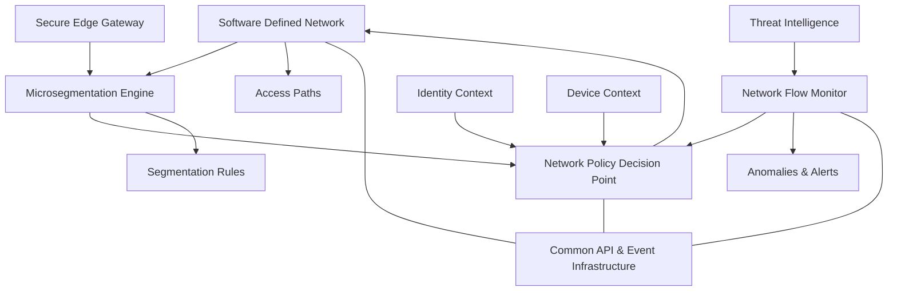

# Network Pillar

The Network pillar enforces granular access boundaries using dynamic segmentation and real-time policy. It treats the network as a hostile environment and minimizes implicit trust.

Key Components:
- SDN (Software-Defined Network): Enables dynamic, policy-driven routing and segmentation. [CISA ZTMM Network Pillar](https://www.cisa.gov/resources-tools/resources/zero-trust-maturity-model)
- Secure Edge Gateway: Filters ingress/egress traffic at key control points. [NIST SP 800-207 – ZTA](https://csrc.nist.gov/publications/detail/sp/800-207/final)
- Microsegmentation Engine: Isolates workloads to contain lateral movement. [CISA ZTMM Network Pillar](https://www.cisa.gov/resources-tools/resources/zero-trust-maturity-model)
- Flow Monitor: Detects anomalous traffic patterns. [NIST SP 800-137](https://csrc.nist.gov/publications/detail/sp/800-137/final)
- Policy Decision Point: Makes access control decisions at the session and flow level.

Inputs:
- Identity and device context
- Threat detection feeds

Outputs:
- Segmentation rules
- Network access paths
- Traffic alerts

  
## Network Pillar - Information Model
 

  
## References

- [CISA Zero Trust Maturity Model v2.0 – Network Pillar](https://www.cisa.gov/resources-tools/resources/zero-trust-maturity-model)
- [NIST SP 800-207 – Zero Trust Architecture](https://csrc.nist.gov/publications/detail/sp/800-207/final)
- [NIST SP 800-137 – Information Security Continuous Monitoring (ISCM)](https://csrc.nist.gov/publications/detail/sp/800-137/final)
